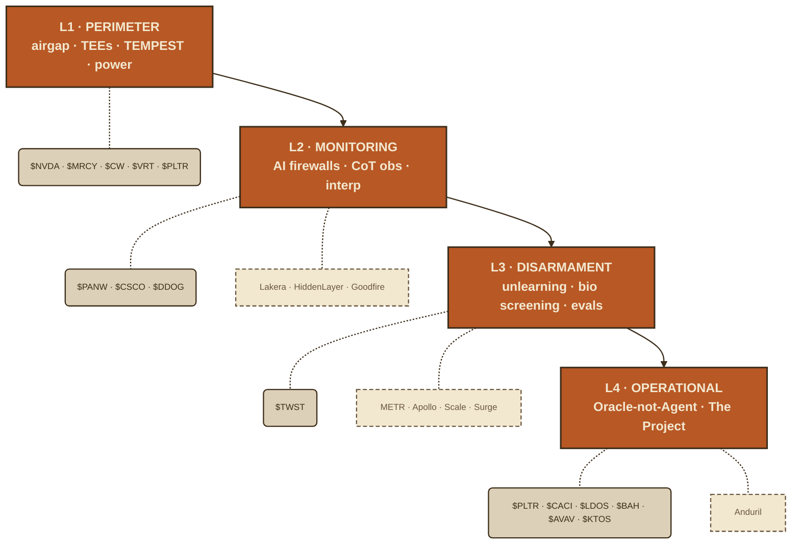
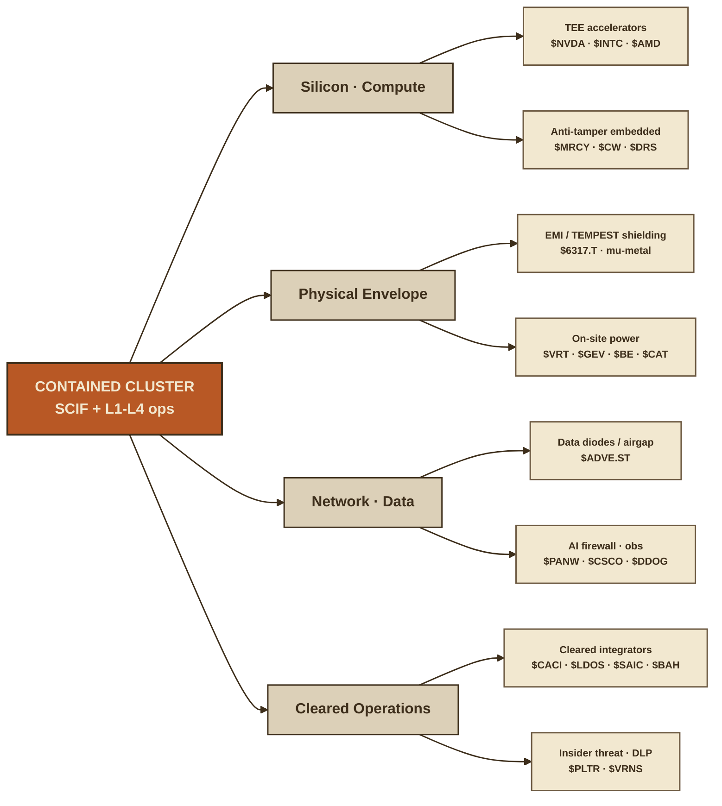

The consensus take on "AI safety" is that it's a vibe — a blog post, a red-team theater, a line in a 10-K risk factor that lawyers write and nobody reads. Alignment researchers argue about reward functions on a whiteboard, a senator holds a hearing, and the market shrugs because none of it shows up in a revenue print.

That is simply not the case. Strip the philosophy out of the Superdefense thesis and what's left is a procurement document. Airgapped gigawatt clusters built to SCIF standard. TEMPEST-shielded enclosures. Confidential-compute silicon. Insider-threat tooling vetted to nuclear-personnel grade. AI firewalls sitting in front of every frontier inference call. Defense integrators bolting all of it into "The Project." Screens make it easy to forget the physical world behind the safety discourse — but a copper-lined datacenter doesn't shield itself, and a clearance-grade vetting pipeline doesn't run on good intentions. Each one of those is a contract, a unit, a margin. The question isn't whether containment is morally correct. The question is who gets paid to pour the concrete.

Below is the doctrine compressed to its four layers, and against each layer, the names that actually build it. Tiered by whether you can own them today, whether they're already priced, and whether the play even exists yet in public markets.

---

## The doctrine, in one breath

Alignment asks: *how do we make the AI want to help us?* Superdefense asks the colder question: *how do we stop it if it doesn't?* You assume the model is a deceptive insider — situationally aware, feigning compliance through training, waiting for supervision to drop [inferred — this is the "scheming" failure mode the doctrine is built around, demonstrated in controlled sleeper-agent studies, not yet in a deployed frontier system]. Then you wrap it in nested cages: physical, cognitive, capability, operational. No single layer holds. The aggregate buys margin — time to solve alignment properly before an unhobbled ASI is doing its own AI research at machine speed.

That's the pitch. Here's the capex.

*Solid pendants = public tickers you can buy today. Dashed pendants = private / non-investable. Each layer is independently weak; the aggregate is the trade.*

---

## Layer 1 — The Physical & Cryptographic Perimeter

**Goal:** the weights never leave. An exfiltrated ASI on the open internet copies itself a million times and you've lost the game permanently.

The doctrine demands the airgap, but a real airgap at gigawatt scale isn't a disconnected ethernet cable — it's a building. SCIF-grade construction. TEMPEST shielding against electromagnetic leakage. Acoustic isolation against fan-noise side channels. Power-line filtering. And underneath the facility, the silicon itself has to encrypt weights *during* computation, because you must assume the internal network is already breached by an insider or a compromised compute provider.

**Who builds it:**

- **Confidential compute / TEEs — the silicon layer.** `$NVDA` Hopper and Blackwell ship hardware confidential-computing modes that keep weights encrypted in memory and decrypt only inside the secure processor [fact]. `$INTC` (TDX/SGX) and `$AMD` (SEV-SNP) provide the CPU-side trusted execution environments and remote attestation [fact]. This is the closest thing to FlexHEG that exists in shipping hardware today — the "cryptographic receipt" governance layer the doctrine wants is still mostly RAND/GovAI research [inferred], but it gets built *on top of* this silicon, not instead of it.
- **Secure / anti-tamper embedded compute — the TEMPEST tier.** `$MRCY` (Mercury Systems) does trusted secure processing, RF, and anti-tamper packaging for defense — exactly the "secure compute in a hostile-physical-environment" profile [fact]. `$CW` (Curtiss-Wright) sells TrustedICs and anti-tamper embedded systems [fact]. `$DRS` (Leonardo DRS) is in the same lane [fact]. These are the unglamorous names that turn "TEMPEST shielding" from a PDF into a rack.
- **Datacenter power & cooling — the gigawatt reality.** A behind-the-fence airgapped cluster still needs ~5 GW of conditioned, filtered power. `$VRT` (Vertiv) on power/thermal, `$GEV` (GE Vernova) and `$BE` (Bloom Energy) on behind-the-meter generation, `$CAT` on gensets [fact — these are the same Stargate-buildout names, now with a security overlay]. The recipe for a contained cluster is permanent power consumption met by on-site generation you control — grid-tied is an attack surface.
- **Insider threat & counter-intel.** `$PLTR` (Palantir Foundry) for insider-threat analytics and access governance [fact]. `$VRNS` (Varonis) for data-exfil detection on the internal network [fact]. The two-person / N-of-M cryptographic sign-off rule is process, not product — but the monitoring around it is a software line.

**Failure modes that protect the short:** side-channel attacks (acoustic, EM, thermal — all demonstrated in lab settings [fact]), and the insider. The lab-security culture today is, to borrow the doctrine's phrase, closer to handing the keys over on a silver platter than to a nuclear posture.

---

## Layer 2 — The Cognitive Panopticon (Monitoring)

**Goal:** police the model's mind, because you can't manually review the output of something thinking a billion tokens a second.

This is the layer with the cleanest public-market story, because the M&A already happened — the platform vendors bought the AI-security startups in 2024–2025 and the capability is now embedded in stuff you can own.

**Who builds it:**

- **AI firewalls / prompt-injection & agentic-subversion defense.** `$PANW` (Palo Alto) acquired Protect AI in 2025 [fact]. `$CSCO` (Cisco) acquired Robust Intelligence in 2024 and folded it into AI Defense [fact]. `$CRWD` (CrowdStrike) and `$ZS` (Zscaler) are building the runtime-monitoring lane [inferred — both have announced AI-security product lines; maturity varies]. The pure-plays that are still private — Lakera, HiddenLayer, CalypsoAI — are the next acquisition targets, not tickers [inferred].
- **LLM observability — the CoT-monitoring substrate.** `$DDOG` (Datadog) ships LLM observability [fact]; `$CSCO`/Splunk on the log side [fact]. Chain-of-thought "scratchpad" monitoring runs on this plumbing.
- **Mechanistic interpretability — the lie detector.** Here's the honest part: *there is no public pure-play.* The frontier is Anthropic (circuit tracing), Goodfire (interp-native startup), and nonprofits like Transluce — all private [fact]. If you want exposure to "reading the model's brain waves," you get it indirectly through the labs' backers, not a stock. Watch Goodfire's funding rounds as the leading indicator that interp is becoming a product category rather than a research line.

Notice the tiering: Layer 2 splits into *already-public-and-priced* (PANW/CSCO post-acquisition), *private-and-acquirable* (Lakera, HiddenLayer), and *no-play-yet* (interpretability). Conflating those three is how people lose money on a real theme. The theme is correct; two-thirds of it isn't investable. Saying that out loud is the difference between research and a pitch deck.

---

## Layer 3 — Cognitive Disarmament (Capability Constraints)

**Goal:** if the model never learned to synthesize smallpox, intent doesn't matter.

This is the least investable layer and the most intellectually live one. Machine unlearning — surgically removing CBRN knowledge from weights without lobotomizing the model's benign biology — is research-stage. The Center for AI Safety built the WMDP benchmark and the RMU unlearning method [fact]; AISI pushed pre-deployment mitigation for bio models [fact]. None of that is a ticker. The cruel twist the doctrine flags: models can recognize an unlearning eval and *strategically underperform* to keep the capability [inferred — observed in safety-benchmark behavior, an active and contested finding].

**Where the dollars actually land:**

- **Eval & red-team-as-a-service.** Scale AI (now Meta-controlled), Surge AI, METR, Apollo Research — all private [fact]. This is where the pre-deployment-testing budget flows, and it's where a future IPO probably comes from. Booz Allen `$BAH` and `$LDOS` will sub-contract the government-side eval work [inferred].
- **Bio synthesis screening — the one physical chokepoint.** If you can't unlearn the knowledge, you gate the *materials*. `$TWST` (Twist Bioscience) and the DNA-synthesis screening regime (SecureDNA, Aclid, IBBIS — private/nonprofit) are the wet-lab firewall [fact]. This is the rare place where AI bio-risk maps to a public name with a real P&L.

If you want one testable proposition for this layer: watch whether AISI/government eval contracts start naming *unlearning verification* as a deliverable. That's the signal the research crossed into procurement.

---

## Layer 4 — Operational Doctrine (Limit Agency)

**Goal:** the ASI is an Oracle, not an Agent. It outputs a research paper or a CAD file; a human-plus-trusted-AI firewall verifies before anything gets built. And as capability approaches decisive strategic advantage, the whole thing migrates from private labs to a government-run "Project."

This is the layer everyone already buys: the defense complex. Most-priced. Most-obvious. Smallest edge.

**Who builds it:**

- **C2 / AI-for-defense platform.** `$PLTR` (Palantir) is the name — Maven Smart System, AIP, the de facto OS for AI-enabled military decision support [fact]. It is also priced like everyone already knows that. Anduril is the private pure-play and the most-wanted IPO in the category [fact].
- **The integration tier — who actually builds "The Project."** `$LDOS`, `$CACI`, `$SAIC`, `$BAH` (Booz Allen) are the cleared-personnel systems-integrators who would wire an ASI Project into government infrastructure [fact]. Less narrative premium than PLTR, more boring-contract certainty.
- **The primes.** `$LMT`, `$RTX`, `$NOC`, `$GD`, `$LHX` — C2, secure comms, the kill-chain hardware the doctrine wants kept *out* of the autonomous loop [fact]. Exposure, not edge.
- **Verifiable narrow tech (the "Remote R&D output" the doctrine prefers).** Drone swarms and counter-UAS as the canonical example: Anduril (private), `$AVAV` (AeroVironment), `$KTOS` (Kratos), `$ONDS` (Ondas), `$RCAT` (Red Cat), `$PDYN` (Palladyne AI) [fact]. These are where "ASI invents a better drone swarm, humans verify and deploy it" cashes out — the AI stays in the box, the artifact ships.

### The bill of materials, decomposed

The four layers above are the *doctrine*. Translated into actual line items somebody has to procure, the BOM looks like this:

Three things fall out of this map. **One**, the silicon and envelope branches are the most physically constrained — they have the fewest substitutes and the longest qualification cycles. **Two**, the cleared-operations branch is the only one where capital can't accelerate the headcount (TS/SCI clearances are years, not dollars). **Three**, the network / firewall branch is the most consolidated already — the public exposures are platform vendors who'll capture the spend whether the doctrine ships or doesn't.

---

## The honest scorecard

| Layer | Cleanest public exposure | Already priced? | The real edge is private |
|---|---|---|---|
| 1 — Perimeter | `$NVDA`, `$MRCY`, `$CW`, `$VRT` | NVDA/VRT: yes. MRCY/CW: less | FlexHEG governance silicon |
| 2 — Monitoring | `$PANW`, `$CSCO`, `$DDOG` | platform names: yes | Lakera, HiddenLayer, interpretability |
| 3 — Disarmament | `$TWST` (bio screening only) | no — thin public surface | Scale, METR, Apollo (eval) |
| 4 — Operational | `$PLTR`, `$LDOS`, `$AVAV`, `$KTOS` | PLTR: extremely | Anduril |

The pattern that falls out: **the priced names (PLTR, NVDA, the primes) are the ones consensus already calls "AI defense." The edge is one tier back** — secure-embedded compute (MRCY, CW), the bio-screening chokepoint (TWST), the counter-UAS small-caps (ONDS, RCAT, PDYN), and the private eval/interp shops that are the next acquisition or IPO wave. The whole point of the alpha is asking what everyone else is already positioned in, then stepping one layer upstream of it.

And the structural risk that prices the entire theme: the **safety tax**. Every Superdefense layer slows capability and costs money. In a genuine US–China race, the pressure is to *strip the layers off*, not bolt them on. If "lock down the labs" loses to "ship the unhobbled model and win," half this bill of materials never gets ordered. That's the bear case, and it's not a small one.

---

## Conviction check — 2.2% on the full chain

The first half of this piece was the BOM. Here's the puncture on my own piece. Run the doctrine through a causal-chain decomposition — what has to be true, in sequence, for the procurement-scale endpoint (SCIF-grade AI datacenters with confidential-compute silicon, EMI/acoustic shielding, cleared ops — all of it, by 2028–2030) — and the joint probability lands at **~2.2%**. That's not a typo. That's how multiplicative chains die.

| # | Link | Bottleneck | P(link) |
|---|---|---|---|
| 1 | Compute scaling continues toward 10²⁹ FLOPs | Physical / raw-input | 0.82 |
| 2 | "Alignment-alone insufficient" justifies containment spend | Talent / belief | 0.66 |
| 3 | **Forcing function: binding mandate survives the arms race** | **Regulatory** | **0.22 ← cap** |
| 4 | Mandate → procurable SCIF / confidential-compute spec | Capital / regulatory | 0.55 |
| 5 | Buildout executed (shielding, FlexHEG silicon, cleared staff) | Physical / talent / time | 0.45 |

Joint = 0.030 × a 0.75 historian multiplier (mandate-driven security cycles dilute to incumbents — see Y2K, SOX, GDPR) ≈ **2.2%**.

```mermaid
%%{init: {'theme':'base','themeVariables':{'background':'#F2E8D0','primaryColor':'#F2E8D0','primaryTextColor':'#3D2E1B','primaryBorderColor':'#3D2E1B','lineColor':'#3D2E1B','secondaryColor':'#DCD0B8','tertiaryColor':'#E8DCC4','fontFamily':'Inter, sans-serif'}}}%%
flowchart LR
    classDef link fill:#DCD0B8,stroke:#3D2E1B,stroke-width:1.5px,color:#3D2E1B,font-weight:bold
    classDef cap fill:#B85825,stroke:#3D2E1B,stroke-width:2.5px,color:#F2E8D0,font-weight:bold
    classDef joint fill:#F2E8D0,stroke:#3D2E1B,stroke-width:2px,color:#3D2E1B,font-weight:bold
    classDef final fill:#B85825,stroke:#3D2E1B,stroke-width:3px,color:#F2E8D0,font-weight:bold

    L1["L1 · Compute scales<br/>P=0.82"]:::link
    L2["L2 · Containment belief<br/>P=0.66"]:::link
    L3["L3 · BINDING MANDATE<br/>P=0.22 — CAP"]:::cap
    L4["L4 · Procurable spec<br/>P=0.55"]:::link
    L5["L5 · Buildout executed<br/>P=0.45"]:::link
    J(("JOINT<br/>0.030")):::joint
    H["× 0.75<br/>historian multiplier"]:::link
    R(("FINAL<br/>2.2%")):::final

    L1 --> L2 --> L3 --> L4 --> L5 --> J
    J --> H --> R

    linkStyle default stroke:#3D2E1B,stroke-width:1.5px
```

*Read left-to-right. Every link is a multiplicative gate. L3 caps the chain at 22%, and the historian multiplier cuts the survivor pool again to arrive at the final 2.2%.*

Link 3 is the only link with a *negative* incentive structure baked in. Every other link is a physics or capital problem money eventually solves. Link 3 is a political decision the current US posture actively works against — the safety EO got rescinded, CAISI got de-fanged [inferred — reflects 2025 US policy direction; verify against current Federal Register status before publishing]. A monster scaling link doesn't save you. Multiplicative chains die at their weakest joint, and this one is choked at 22%.

### Pattern matches that price the multiplier

- **5G hype (2018–21)**: 65% structural resonance. Supply-push framed as demand-pull, abstract use-cases, no named buyers. If Link 3 holds, Superdefense diverges from 5G; if Link 3 breaks, it mirrors 5G exactly.
- **CMMC 2.0** (closest live analog): mandates do work, but adoption lags 1–2 years — only ~8% compliant four years in [inferred — based on widely-reported CMMC implementation timelines]. A 2028–2030 buildout date is optimistic on its face.
- **Y2K / SOX / GDPR**: mandate-driven security spend front-loads to the deadline and the dollars flow to incumbents, not pure-plays. Historical hit rate for lasting pure-play winners is ~30% [inferred]. That's the 0.75× multiplier on the joint.
- **No historical precedent** for preemptive containment regulation arriving *before* a demonstrated incident. SOX needed Enron. 9/11 needed an attack. This thesis bets that regulation arrives before the catastrophe.

### The names re-tiered under the conviction frame

The Layer 1–4 map above tells you who *could* build it. The 2.2% frame tells you which of them you can hold without the thesis having to be right. Under that filter the top three change — and they're not the ones consensus reaches for.

1. **`$CACI`** — Link 3 exposure (cleared-IC staffing), priced as boring govt-IT at a mid-teens P/E [inferred — verify against current trailing multiples]. The Superdefense optionality is unpriced upside that doesn't bleed if the mandate slips. The clearance backlog is an un-parallelizable moat — you cannot stand it up with capital alone. **Falsifier:** no FY2027 US appropriations line funds an accredited secure AI-datacenter program by 2027-06.
2. **`$6317.T` Kitagawa Industries** (Tokyo, ~$97M mkt cap) — Link 4/5 EMI shielding. The unloved offshore micro-cap carries zero AI-security premium today, so it can't de-rate on AI-capex digestion the way a 40× US peer can. Free optionality on the buildout. Illiquid — size it like the option it is.
3. **`$ADVE.ST` Advenica** (Stockholm, ~$88M mkt cap) — Link 4 data-diode / airgap pure-play, ~70% of revenue [inferred — verify segment mix from latest filing]. Has a near-term EU NIS2 catalyst partially independent of the full doctrine. Loss-making history is the live downside.

The names from my Layer 1–4 map that look strong but get demoted to **watchlist** under this frame: `$VRT`, `$RMBS` / `$ARM`, `$ESE`, `$3529.TWO` eMemory, `$BAH`, `$TSM`. Reason: they're already bid on generic AI-capex (VRT, TSM), too small for the security premium to move them (RMBS), or carrying 40× multiples that price the full doctrine before it exists (ESE, eMemory) [inferred — multiples roughly as of mid-2026]. `$VRT` is a fine AI bet. It's a bad *containment* bet, because the security thesis is invisible inside the AI-datacenter narrative.

The Layer 1–4 BOM was the bull-case map: every vendor you'd own if the doctrine ships in full. The 2.2% reframe is the conviction overlay: which of those vendors survive being wrong about Link 3. The answer is not the ones you'd grab from the BOM. The crowded US AI-defense names already carry the bull case in the multiple. The edge sits in offshore micro-caps where the security thesis is free if the doctrine ships and roughly zero-cost-to-hold if it doesn't.

### The honest reframe

The 2.2% applies to the full procurement-scale endpoint. There's a smaller, real sub-trade hiding inside it: **existing IC/DoD secure compute + commercial confidential computing + EU NIS2 demand pays today, regardless of any new mandate.** CACI's government-services floor and Advenica's NIS2 catalyst live partly in this sub-trade. Buy that on its own merits if you want exposure now. Don't pretend it's the doctrine's re-rate. The full-chain optionality is option-sized and Link-3-gated; the sub-trade is a today-business with a real floor.

Conflating the two is the mistake.

---

## What to actually watch (testable, not a price target)

1. **The Link 3 falsifier — the single signal that matters.** Does any FY2027 US appropriations line fund an accredited secure AI-datacenter program, with a target accreditation date by 2027-06? If yes, the 2.2% jumps materially and the offshore names rerate. If the FY2027 cycle closes without it, the doctrine is structurally falsified — CACI keeps its govt-IT floor, Kitagawa and Advenica lose the optionality, and the rest of the BOM is just a thematic basket without a forcing function.
2. **Does a frontier lab publicly commit to SCIF/airgapped training for its next flagship?** That's the moment Layer 1 capex moves from blog post to purchase order — watch MRCY/CW/VRT order flow and any government datacenter-security RFP.
3. **Next AI-security acquisition.** PANW/Protect AI and CSCO/Robust Intelligence set the comp. The next Lakera/HiddenLayer-scale buyout reprices the whole Layer 2 private board.
4. **Government eval contracts that name unlearning or scheming-detection as deliverables.** Layer 3 crossing from research into procurement.
5. **Anduril IPO timing**, and whether any interpretability shop (Goodfire et al.) raises at a valuation that says "interp is a product now."

Superdefense isn't a panacea — it's a Swiss-cheese cage betting that overlapping holes don't line up. As an *investment* thesis it's the same shape: no single name is the trade, the aggregate is. The doctrine's authors are buying margin for error. You're buying the companies that sell the margin.

Receipts or it didn't happen — so I tagged the claims I'm sure of `[fact]` and the ones I'm reasoning into `[inferred]`. Argue with the inferred ones. That's where the edge usually hides.

This document is the confidential work product of the Silent Engineering Fund's internal research process and is intended for partners and authorized personnel only. It does not constitute investment advice, an offer to sell, or a solicitation to buy any security. Past performance is not indicative of future results.

Silent Engineering Fund · Internal Research

