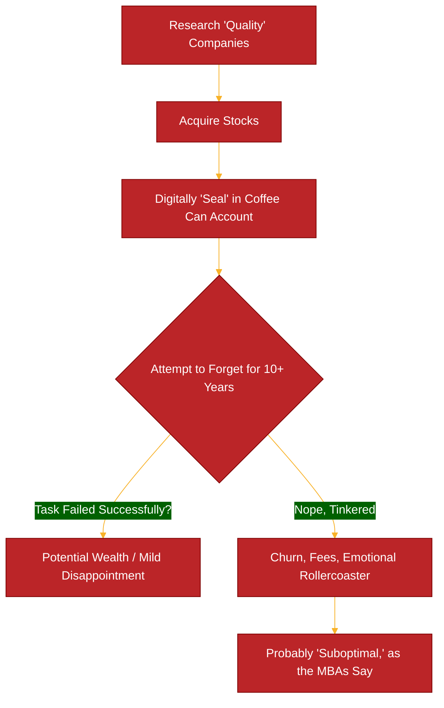

Alright, gather 'round folks, let's talk about something ancient. No, not COBOL, though it shares a similar "set it and forget it, hope it doesn't explode" vibe. I'm talking about the "Coffee Can Portfolio."

I know, I know. In a world where my fridge probably has more processing power than the Apollo missions and we're all chasing the next 100x AI-powered, blockchain-enabled, decentralized, organic, gluten-free disruptive innovation, why are we discussing a strategy that sounds like your grandpa's? Because, frankly, the sheer audacity of its simplicity in May 2025 is just *chef's kiss*.

Given all the volatility this year with Trump's Traffic Tantrum, we are seeing significant concerns around business uncertainties. The old strategies of HODLING is being muted, while retail investors hold up the market. While also being busy with work, and not being able to day-trade like I used to - I started thinking about "set it and forget it" and "sell in May and go away." Two adages that are still HODLING true today. 

Picture this: Old West. People apparently didn't trust banks so, they'd stuff their valuables—cash, deeds, a particularly shiny rock—into an actual coffee can and hide it under the mattress. Fast forward to 1984, a capital-M Manager named Robert Kirby (Source 1, 2) looked at this and thought, "Huh, what if we did that with stocks?" The idea? Buy shares in good companies, "put them in a coffee can," and then—this is the crucial part—*forget about them* for a decade or more.

## The "Genius" Behind Stuffing Cash Under the Mattress (But with Stocks)

So, why would any self-respecting, YAML-wrangling, Kubernetes-cluster-taming engineer entertain this notion?

1.  **The Power of Compounding (aka "Magic Internet Money Grows Slowly"):** Hold good stuff, it (hopefully) grows. Reinvest dividends (if any), it grows more. Basic. Even I can understand that.

2.  **Avoiding FFS (Frequent Fiddling Syndrome):** Turns out, we are often our own worst enemies. We panic sell. We FOMO buy. We tinker. The coffee can says, "Hands off, meatbag!" By not trading, you save on fees and, more importantly, save yourself from your own terrible impulses (Source 3).

3.  **Riding Out Volatility (aka "HODLing Before It Was Cool"):** Markets go up, markets go down. Sometimes they do a little jig. If you're not looking, you can't get scared by the dips.

It’s like deploying a really solid, well-architected monolith. You know, the kind your predecessors wrote in a language no one quite understands anymore, but it just *works*. You don't dare touch it for fear of breaking the ancient magic. Is it optimal? Debatable. Does it sometimes outperform the constantly-refactored-microservice-of-the-week? *Annoyingly, yes.*

## Candidates

Some companies I am putting in this portfolio are the following: 

- Waste Management ($WM) - Industrials
- O'Reilly Auto Parts ($ORLY) - Consumer Cyclical
- Costco ($COST) - Consumer Discretionary
- Constellation Software ($CNSWF) - Investments / Software
- Lockheed Martin ($LMT) - Defense 

These are "boring" investments, but they also demonstrate high quality, large moats, established and money-printing businesses. To which, I am absolutely comfortable with "setting and forgetting" these.

In some other post (in the future) I will breakdown my portfolio allocation across all asset classes.