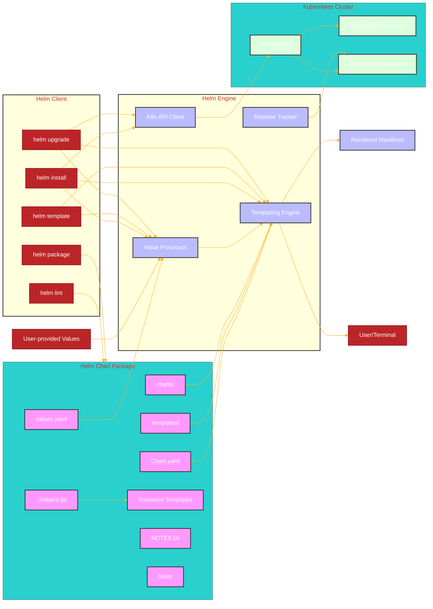

```mermaid
%%{init: {'theme': 'base', 'themeVariables': { 'primaryColor': '#BB2528', 'primaryTextColor': '#fff', 'primaryBorderColor': '#7C0000', 'lineColor': '#F8B229', 'secondaryColor': '#006100'}}}%%
graph LR
    UserInputValues["User-provided Values"] --> ValueProcessor

    subgraph HelmChart["Helm Chart Package"]
        ChartYaml["Chart.yaml"]
        ValuesYaml["values.yaml"]
        TemplatesDir["templates/"]
        ChartsDir["charts/"]
        HelpersTpl["_helpers.tpl"]
        ResourceTemplates["Resource Templates"]
        NotesTxt["NOTES.txt"]
        TestDir["tests/"]
    end

    subgraph HelmClient["Helm Client"]
        HelmInstall["helm install"]
        HelmTemplate["helm template"]
        HelmUpgrade["helm upgrade"]
        HelmLint["helm lint"]
        HelmPackage["helm package"]
    end

    subgraph HelmEngine["Helm Engine"]
        ValueProcessor["Value Processor"]
        TemplatingEngine["Templating Engine"]
        ReleaseTracker["Release Tracker"]
        K8sClient["K8s API Client"]
    end

    subgraph K8sCluster["Kubernetes Cluster"]
        APIServer["API Server"]
        DeployedResources["Deployed Resources"]
        ReleaseObject["Helm Release Object"]
    end

    ValuesYaml --> ValueProcessor
    ChartYaml --> TemplatingEngine
    TemplatesDir --> TemplatingEngine
    HelpersTpl --> ResourceTemplates
    ChartsDir --> TemplatingEngine
    ValueProcessor --> TemplatingEngine
    TemplatingEngine --> RenderedManifests["Rendered Manifests"]

    HelmInstall --> ValueProcessor
    HelmInstall --> TemplatingEngine
    HelmInstall --> K8sClient
    K8sClient --> APIServer
    APIServer --> DeployedResources
    APIServer --> ReleaseObject
    ReleaseTracker --> ReleaseObject

    HelmTemplate --> ValueProcessor
    HelmTemplate --> TemplatingEngine
    TemplatingEngine --> UserOutput["User/Terminal"]

    HelmUpgrade --> ValueProcessor
    HelmUpgrade --> TemplatingEngine
    HelmUpgrade --> K8sClient

    HelmLint --> HelmChart
    HelmPackage --> HelmChart

    classDef chart fill:#f9f,stroke:#333,stroke-width:2px
    classDef process fill:#bbf,stroke:#333,stroke-width:2px
    classDef k8s fill:#dfd,stroke:#333,stroke-width:2px
    classDef helm fill:#ffd,stroke:#333,stroke-width:2px

    class ChartYaml,ValuesYaml,TemplatesDir,ChartsDir,HelpersTpl,ResourceTemplates,NotesTxt,TestDir chart
    class ValueProcessor,TemplatingEngine,RenderedManifests,ReleaseTracker,K8sClient process
    class APIServer,DeployedResources,ReleaseObject k8s
    class HelmClient,HelmEngine helm
```