## Supply Chain Security with Digital Signatures

Implementing digital signatures in CI/CD pipelines provides a crucial layer of verification and authenticity for artifacts as they move through your development ecosystem.

## Diagram: Artifact Signing Process Flow

```mermaid
sequenceDiagram
    participant Developer
    participant BuildSystem
    participant Registry
    participant PlatformTeam
    participant Customer

    Developer->>BuildSystem: 1. Commit Code (triggers build)
    Note left of Developer: "The Kitchen" – developers codebase
    BuildSystem->>BuildSystem: 2. Build Image + Generate Attestation
    BuildSystem->>Registry: 3. Push Image (tag:dev)
    BuildSystem->>Registry: 4. Sign Image (cosign + dev.key)
    BuildSystem->>Registry: 5. Attach Provenance Attestation (signed)

    PlatformTeam->>Registry: 6. Pull Image & Attestation
    PlatformTeam->>PlatformTeam: 7. Verify Developer Signature
    PlatformTeam->>PlatformTeam: 8. Verify Attestation (cosign verify-attestation)
    Note right of PlatformTeam: Checks build provenance:<br/>- Source repo<br/>- Build command<br/>- Commit hash<br/>- Builder identity

    alt Attestation Valid
        PlatformTeam->>Registry: 9. Sign with Platform Key (prod-tag)
    else Attestation Invalid
        PlatformTeam-->>Developer: 🔒 Reject: Build provenance mismatch
    end

    Customer->>Registry: 10. Pull Image (prod-tag)
    Customer->>Customer: 11. Verify Platform Signature (platform.pub)
```

The diagram above illustrates the flow of artifacts through a typical CI/CD pipeline, highlighting the signing and verification steps.
