## Supply Chain Security with Digital Signatures

Implementing digital signatures in CI/CD pipelines provides a crucial layer of verification and authenticity for artifacts as they move through your development ecosystem.

## Diagram: Artifact Signing Process Flow

```mermaid
sequenceDiagram
    participant Developer
    participant BuildSystem
    participant Registry
    participant PlatformTeam
    participant Customer

    Developer->>BuildSystem: 1. Commit Code (triggers build)
    Note left of Developer: "The Kitchen" – developers codebase
    BuildSystem->>BuildSystem: 2. Build Image + Generate Attestation
    BuildSystem->>Registry: 3. Push Image (tag:dev)
    BuildSystem->>Registry: 4. Sign Image (cosign + dev.key)
    BuildSystem->>Registry: 5. Attach Provenance Attestation (signed)

    PlatformTeam->>Registry: 6. Pull Image & Attestation
    PlatformTeam->>PlatformTeam: 7. Verify Developer Signature
    PlatformTeam->>PlatformTeam: 8. Verify Attestation (cosign verify-attestation)
    Note right of PlatformTeam: Checks build provenance:<br/>- Source repo<br/>- Build command<br/>- Commit hash<br/>- Builder identity

    alt Attestation Valid
        PlatformTeam->>Registry: 9. Sign with Platform Key (prod-tag)
    else Attestation Invalid
        PlatformTeam-->>Developer: 🔒 Reject: Build provenance mismatch
    end

    Customer->>Registry: 10. Pull Image (prod-tag)
    Customer->>Customer: 11. Verify Platform Signature (platform.pub)
```

The diagram above illustrates the flow of artifacts through a typical CI/CD pipeline, highlighting the signing and verification steps.

Now continuing the overall setup, if you had end users you were distributing artifacts (OCI compliant) to, then what would the entire sequence look like end-to-end? 

> I use AWS KMS in this example, but any key_types (keyless, asym-keys, cloud-KMS, cloudHSM, etc) are supported by Cosign. 

